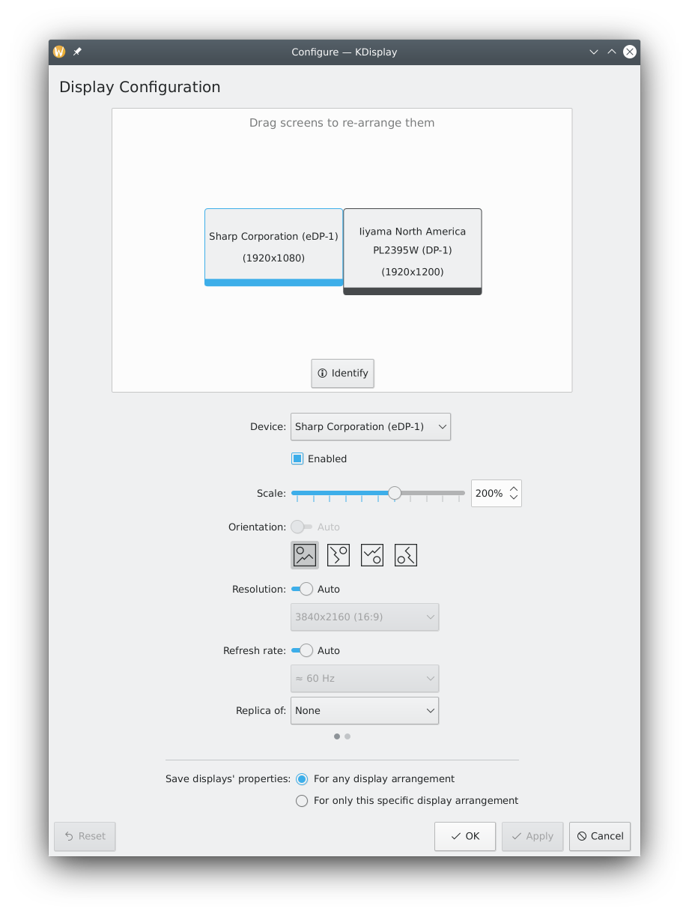

# KDisplay

KDisplay is a small display management app.
It provides a simple and straightforward UI for managing an arbitrary number of displays.

  

## Features
* Displays can be repositioned with drag-and-drop.
* An optimal resolution and refresh rate are automatically selected.
  Manual override is possible.
* Displays can be seemlessly "replicated".
* The settings of a display is by default remembered globally
  but can be overridden for specific combinations of displays.
* Provides additional integration for the KDE Plasma Workspace through a plasmoid and an OSD
  activated by hardware key for quick configuration changes.

## Installation
### Requirements
KDisplay works with many windowing system and compositors:
* Any X11 desktop
* Wayland:
  * KWinFT and KWin
  * sway and other wlroots based compositors

### Packages
Your distribution might provide KDisplay already as a package:
* Arch(AUR): [kdisplay-kwinft][aur-package]
* Manjaro: `sudo pacman -S kdisplay`

### Compile from source
KDisplay can also be compiled from source with following dependencies:
* Extra CMake Modules
* Qt
* Disman
* KDBusAddons
* KDeclarative
* KI18n
* Kirigami

Configure, build and install KDisplay like any other CMake based project.
You can install it to your normal system directory.
This will also ensure certain service files
for integration with the KDE Plasma workspace
will be picked up correctly.

## Usage
### App
Just run `kdisplay` from command line
or look for the "Displays" entry in the launcher that your desktop environment provides.

### KDE Plasma integration
On laptops the OSD can be activated by hardware key.
The plasmoid is available in the systems tray.

### Reporting issues
See first the respective section in [Disman's Readme][disman-reporting-issues].
In case KDisplay is identified as being responsible for the issue you experience
and no [issue ticket][issue] exists yet for this specific issue please create a new ticket.

## Translations
KDisplay has been translated to the following languages already:

We use the [Weblate][weblate] service for localization.
If you want to help us translating KDisplay to your native or other languages
please join us there.

## Contributing
If you are interested in improving the KDisplay source code directly,
see the [CONTRIBUTING.md](CONTRIBUTING.md) file on how to get started.

[aur-package]: https://aur.archlinux.org/packages/kdisplay-kwinft
[disman-reporting-issues]: https://gitlab.com/kwinft/disman#reporting-issues
[issue]: https://gitlab.com/kwinft/kdisplay/-/issues
[weblate]: https://hosted.weblate.org/engage/kwinft
